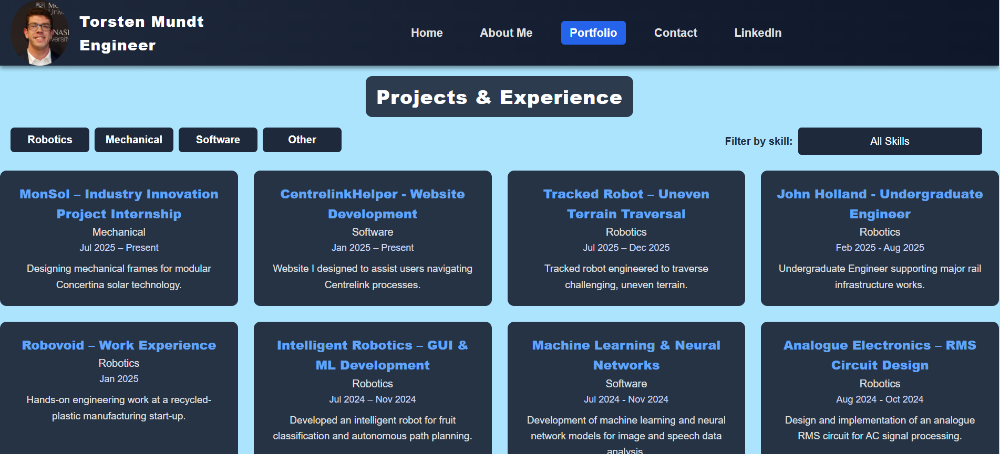

# TorstenMundtEngineer-Portfolio-Website

Personal portfolio website showcasing my engineering projects, skills, and experience in robotics, mechatronics, AI, and automation. Built with HTML, CSS, and JavaScript, and hosted on Cloudflare.

Explore my website: [torstenmundtengineer.com](https://torstenmundtengineer.com)

---

## Overview

This website introduces me as a **final-year Engineering (Honours) student at Monash University**, showcases my projects, and provides ways to get in touch. It highlights my passion for integrating mechanical, electrical, and software engineering to create real-world solutions.

Graduating in June 2026, I aim to secure my first full-time engineering role. Beyond engineering, I enjoy travelling, attending AFL games, mentoring in STEM, learning languages, and playing jazz saxophone.

---

## Features / Pages

- **Home:** Brief introduction, personal photo, and highlights of my academic and professional journey.  
- **About Me:** Overview of education, awards, internships, volunteering, hobbies, and personal interests.  
- **Portfolio:** Gallery of engineering projects with filters for Robotics, Mechanical, Software, and Other projects, as well as related and valuable skills.  
- **Contact:** Email, phone, LinkedIn, and contact form for easy communication.  
- **LinkedIn:** Redirects directly to my LinkedIn profile for professional networking.

---

## Tech Stack

- **Frontend:** HTML5, CSS3, JavaScript  
- **Hosting:** Cloudflare Pages  
- **Design principles:** Fully responsive, clean, and interactive layout

---

## Screenshots

1. **Home Page**  

3. **Portfolio Page**  

---

## Development Notes

- Entirely **static website**, no backend or server-side processing.  
- Built with usability, accessibility, and responsiveness in mind. 

---

## Contact & Links

- Website: [torstenmundtengineer.com](https://torstenmundtengineer.com)  
- Email: `torstenmundt@outlook.com`  
- LinkedIn: [linkedin.com/in/torsten-mundt](https://linkedin.com/in/torsten-mundt)  
- Phone: +61 490 042 522  

---

## License

MIT License – feel free to explore the code for learning purposes, but do not use personal content without permission.
